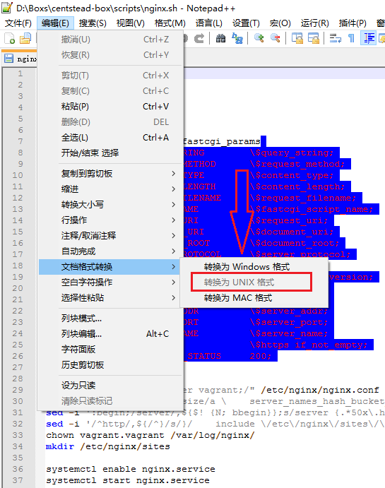

#文档
#### [Fuck GFW](#Fuck GFW)
#### [开始](#start)
#### [公钥自动导入]
#### 端口映射
#### 文件拷贝
#### 共享文件夹
#### 数据库导出
#### 数据库创建
#### 环境配置
1. [PHP版本切换](php.md)
2. [Mysql/MariaDB版本切换](mysql.md)
3. [PostgreSql版本切换](postgre.md)

## 项目配置
1. [Web服务配置](sites.md)

<h2 id="Fuck GFW">Fuck GFW</h2>

`vagrant provision`前请注意由于GFW的原因,初始化过程中可能经常失败,请尽量使用个人ADSL网络,操作前尽量重连ADSL更换IP.
(GFW会根据IP计算HTTPS流量,HTTPS流量高后被断链的几率将增大)